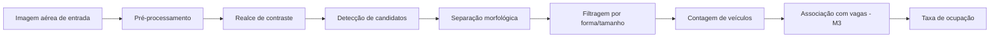
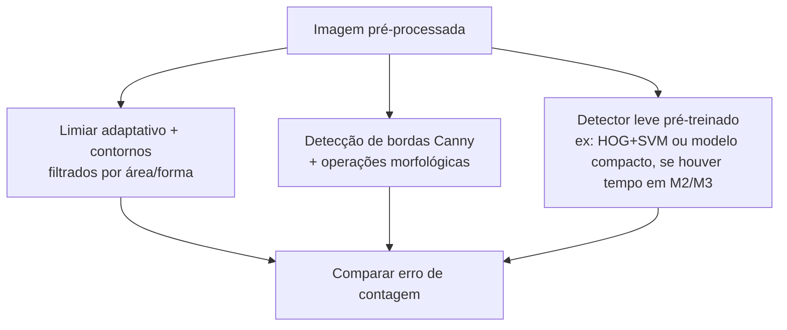
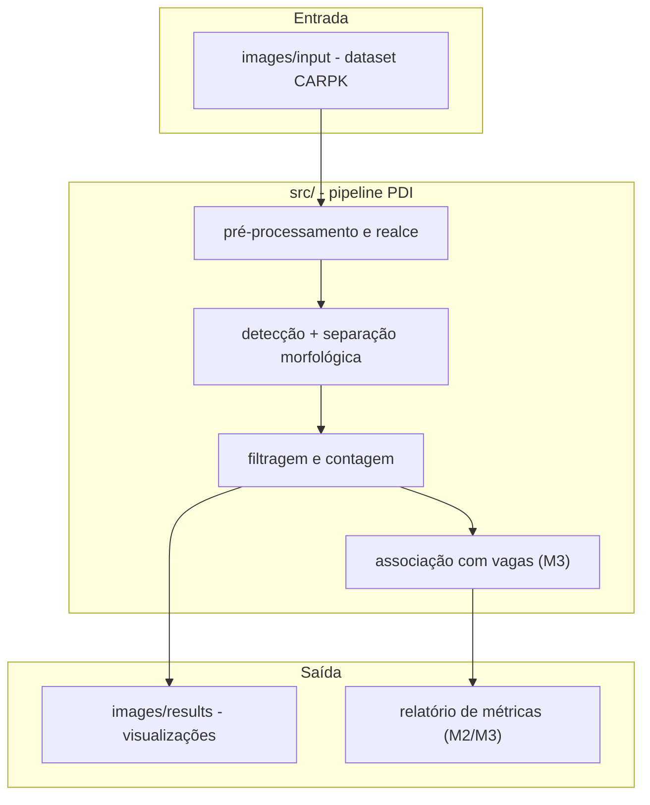

# Proposta Técnica — M1
## Contagem de Veículos em Estacionamentos a partir de Imagens Aéreas

---

## 1. Problema

### 1.1 O que será investigado

Estacionamentos de grande porte (shoppings, aeroportos, campi, eventos)
precisam saber, com frequência, quantos veículos estão presentes em um
determinado momento, para gestão operacional, sinalização de vagas
disponíveis ou planejamento de eventos. A contagem manual (funcionário
percorrendo o local) ou por sensores individuais por vaga é cara e difícil
de escalar.

Este projeto investiga até que ponto técnicas de Processamento Digital de
Imagens conseguem **detectar e contar veículos automaticamente** a partir
de uma única imagem aérea (capturada por drone ou disponível via imagem de
satélite), e evoluir para uma **estimativa de ocupação** (vagas ocupadas
vs. vagas totais visíveis).

### 1.2 Por que envolve PDI

O problema depende diretamente de:

- **Realce de contraste**: veículos em estacionamentos aparecem com baixo
  contraste em relação ao asfalto, especialmente em cores escuras ou sob
  sombra.
- **Segmentação e detecção de blobs**: separar formas retangulares
  (veículos) do fundo (asfalto, marcações de vaga, vegetação).
- **Morfologia matemática**: separar veículos estacionados muito próximos
  uns dos outros (situação comum em estacionamentos lotados).
- **Geometria/orientação**: veículos aparecem em ângulos variados
  dependendo da disposição das vagas, o que exige que a detecção não
  dependa de uma orientação fixa.

### 1.3 Situação inicial e informação a ser produzida

**Entrada:** imagem aérea (vista de cima, drone ou satélite) de um
estacionamento, em RGB.

**Saída pretendida (evolutiva ao longo do semestre):**
- **M1/M2:** número total de veículos detectados na imagem + marcação
  visual de cada detecção.
- **M3:** taxa de ocupação do estacionamento (veículos detectados / total
  de vagas identificadas na imagem), com uma métrica de acerto sobre um
  conjunto de teste anotado.

---

## 2. Contexto de aplicação

O sistema não pretende substituir sensores de precisão por vaga em
aplicações críticas, mas servir como **apoio de baixo custo** para gestão
de estacionamentos de médio/grande porte: um sobrevoo periódico de drone
(ou uma imagem de satélite atualizada) seria suficiente para estimar
ocupação sem infraestrutura de sensores instalada em cada vaga.

Esse contexto é suficientemente concreto para definir critérios de sucesso
(comparação da contagem automática com a contagem de referência do
dataset) e compatível com o escopo de uma disciplina de graduação, sem a
pretensão de uso comercial imediato.

---

## 3. Objetivo

### Objetivo geral
Desenvolver um pipeline de PDI que, a partir de uma imagem aérea de um
estacionamento, detecte e conte os veículos presentes, evoluindo para uma
estimativa de taxa de ocupação.

### Objetivos específicos
1. Implementar um pipeline de pré-processamento robusto a variações de
   iluminação, sombra e contraste típicas de imagens aéreas.
2. Detectar veículos independentemente de sua orientação na imagem.
3. Separar veículos estacionados próximos/colados (situação de
   estacionamento cheio).
4. Validar a contagem automática contra a contagem de referência (ground
   truth) do CARPK Dataset, medindo erro absoluto médio.
5. (M2/M3) Identificar as vagas marcadas na imagem (quando visíveis) para
   calcular taxa de ocupação, não só contagem absoluta.
6. (M3) Comparar o pipeline clássico com uma alternativa mais robusta
   (ex.: um detector leve pré-treinado) e discutir os trade-offs.

---

## 4. Entrada e saída esperadas

```text
imagem aérea de estacionamento (RGB)
   ↓
pré-processamento (realce de contraste, redução de ruído)
   ↓
detecção de candidatos a veículo (segmentação / detecção de blobs)
   ↓
separação de veículos próximos (morfologia / watershed)
   ↓
filtragem por forma e tamanho (descarta ruído, marcações de solo)
   ↓
contagem de veículos ──────────────────► [M1/M2: saída principal]
   ↓
associação com vagas identificadas (M3)
   ↓
taxa de ocupação ──────────────────────► [M3: saída principal]
```

### Critérios de sucesso (verificáveis)
- **Contagem:** erro absoluto médio entre contagem automática e contagem
  de referência (anotações do CARPK), medido sobre um subconjunto de
  imagens de teste.
- **Ocupação (M3):** proporção de vagas corretamente classificadas como
  ocupadas/vazias, quando a segmentação de vagas for viável a partir das
  imagens disponíveis.

---

## 5. Pipeline preliminar



### Alternativas consideradas para a etapa de detecção



### Detalhamento por etapa

| Etapa | Finalidade | Técnica(s) inicialmente consideradas | Entrada | Saída | Dúvidas em aberto |
|---|---|---|---|---|---|
| Pré-processamento | Reduzir ruído, padronizar imagem | Gaussian blur, CLAHE (equalização adaptativa de histograma) | Imagem RGB | Imagem filtrada | CLAHE é suficiente para sombras fortes, ou será preciso remoção de sombra dedicada? |
| Realce de contraste | Destacar veículos do asfalto | CLAHE em canal de luminância (espaço Lab) | Imagem filtrada | Imagem com contraste realçado | Veículos de cor muito próxima do asfalto (cinza, prata) continuam difíceis? |
| Detecção de candidatos | Identificar regiões prováveis de veículo | Segmentação por limiar no canal de saturação (HSV) — técnica adotada após uma primeira tentativa por bordas (Canny) ter falhado devido às marcações de vaga | Imagem realçada | Máscara binária de candidatos | Veículos de baixa saturação (branco/cinza/preto) não são bem capturados por esse critério sozinho — como lidar com eles é uma questão em aberto para a M2 |
| Separação morfológica | Separar veículos colados/próximos | Erosão/abertura morfológica; watershed se necessário (técnica já validada no experimento preliminar) | Máscara de candidatos | Máscara com regiões separadas | Veículos muito próximos (estacionamento cheio) exigem watershed com marcadores mais sofisticados? |
| Filtragem por forma/tamanho | Descartar ruído (sombras, marcações, vegetação) | Filtro por área mínima/máxima e razão de aspecto (veículos são aproximadamente retangulares) | Máscara separada | Lista de candidatos válidos | Qual faixa de área/aspecto generaliza bem para diferentes resoluções de imagem no dataset real? |
| Contagem | Produzir a métrica principal da M1/M2 | Contagem de regiões válidas após filtragem | Lista de candidatos | Número de veículos | Como validar contra o ground truth do CARPK de forma automatizada? |
| Associação com vagas (M3) | Calcular taxa de ocupação | Detecção de grade de vagas (linhas) ou uso de anotações de vaga do dataset, quando disponíveis | Imagem + detecções | Taxa de ocupação | O dataset escolhido tem anotação de vagas, ou só de veículos? Isso pode limitar o escopo do M3. |

---

## 6. Arquitetura preliminar



Nesta fase, o "sistema" é essencialmente um script Python sequencial
(`src/experimento_contagem.py`). Conforme o projeto evoluir para M2/M3,
está prevista a separação em módulos (`preprocessamento.py`,
`deteccao.py`, `ocupacao.py`) e a criação de um notebook de análise de
resultados e comparação de métodos.

---